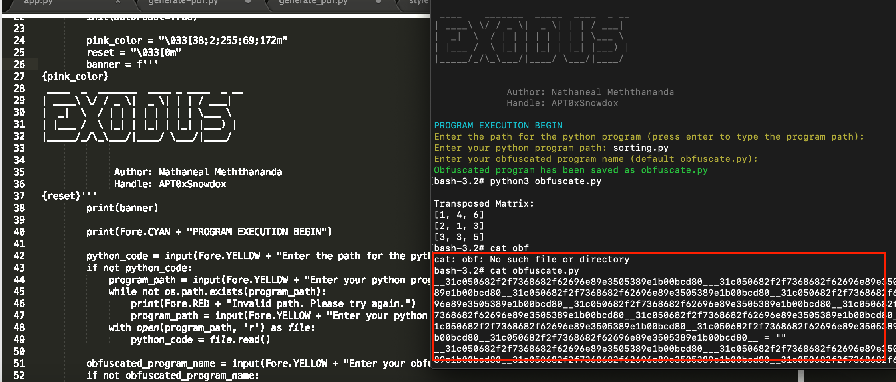

# Exodus
---

# Exodus - Python Code Obfuscation Tool



Exodus is a powerful and flexible Python code obfuscation tool designed to help protect your Python scripts from reverse engineering and unauthorized use. It provides a range of obfuscation techniques that make it harder to understand and modify your code, ensuring your intellectual property remains secure.

## Features

- **Variable Renaming**: Renames variables to obscure names.
- **Function Encryption**: Encrypts function names and calls.
- **String Encryption**: Encrypts strings in the code to prevent easy inspection.
- **Code Flattening**: Removes structure, such as indentation and comments, making the code harder to read.
- **Control Flow Obfuscation**: Alters the control flow to make the execution path less clear.
- **Compatibility**: Supports Python 3.x.

## Installation

To install Exodus, simply clone this repository and install the required dependencies:

```bash
git clone https://github.com/your-username/Exodus.git
cd Exodus
pip install -r requirements.txt
```

## Usage

To obfuscate a Python script, run the following command:

```bash
python exodus.py 
```

Additional options are available to customize the obfuscation process. Use the `-h` or `--help` flag to see all available options.

```bash
python exodus.py --help
```

## Example

Here is a simple example of how to use Exodus:

```bash
python exodus.py -i sample.py -o obfuscated_sample.py
```

This command will obfuscate `sample.py` and save the result to `obfuscated_sample.py`.

## Contributing

We welcome contributions to Exodus! If you have an idea for a new feature or have found a bug, please open an issue or submit a pull request.

## License

This project is licensed under the MIT License - see the [LICENSE](LICENSE) file for details.

## Disclaimer

Exodus is intended for educational purposes and the protection of your own intellectual property. It should not be used for malicious purposes or to obfuscate code that you do not have permission to modify. Always comply with legal and ethical standards when using this tool.

## Acknowledgments

- Thanks to all contributors and the open-source community for their support and contributions.

---

Make sure to replace `path/to/your/image.png` with the actual path or URL of the image you want to include in your `README.md` file. The image can be hosted on GitHub itself (in the repository) or on an external service.
